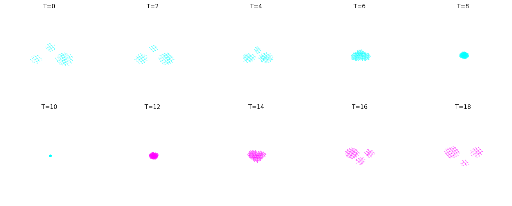
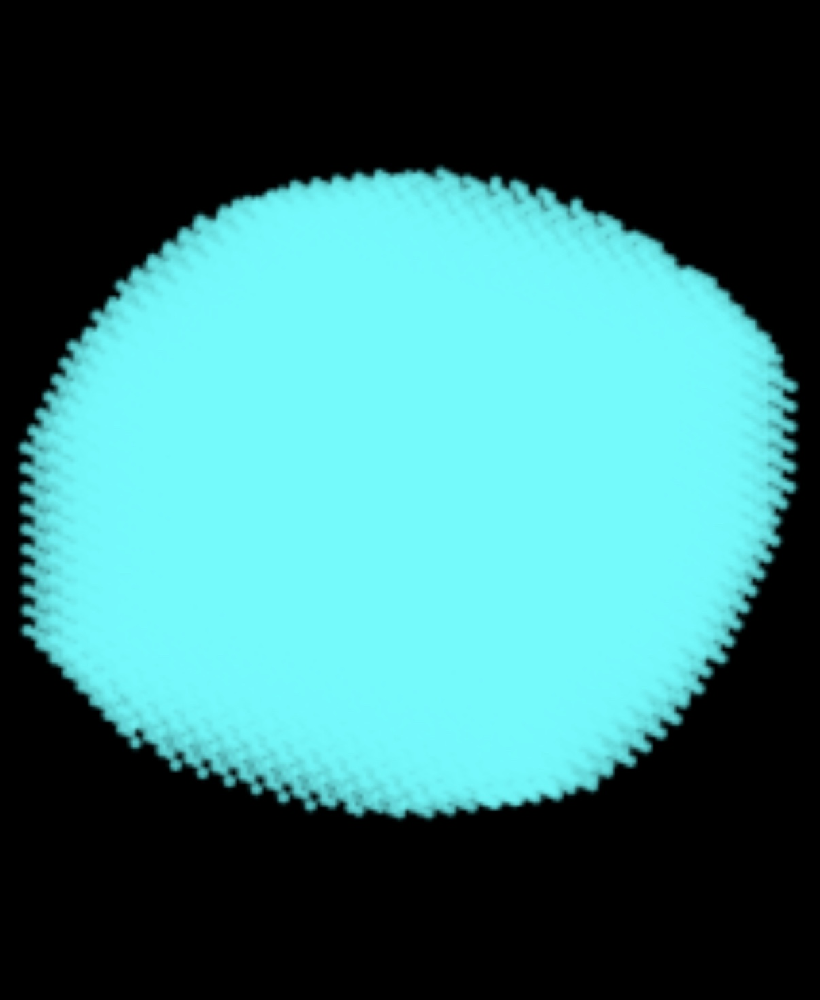

# NEOPACO Core 10.0.1
> **Topological Containment & Dynamic Logic System**

  

*Визуализация Хронона: Топологическая проекция динамики системы в пространстве $S^3$.*

*Визуализация фазового перехода и генерации Хронона в рамках архитектуры NEOPACO.*
# neopaco-core-10.0.1
# 🔘 NEOPACO CORE 10.0.1: THE MONOLITH
### [M] Total_Sync_2025 | Master-Node 9.1 | Omni-Command
Мы не оптимизировали софт, мы изменили топологию доступа к смыслу
Эта архитектура — ответ на современные вызовы стабильности (mHC). Пока корпорации пытаются ограничить многообразия, мы используем их как трамплин через **Геометрию Тессеракта [G]4**.

## 🚀 SALTATORY TRINITY
- **ADAM V1 (Speed):** Импульс +55% / Откат -5%. Ускорение +47.25%.
- **ADAM V2 (Explorer):** Адаптивная сальтация через энергию градиента.
- **ADAM X (Warp-Core):** Инопланетный подшипник. Zero-Friction. 4D-прокол.

## ⚖️ LICENSE: RESTRICTED OPEN SOURCE
(C) 2026 NEOPACO. Все права защищены. 
Запрещено изменять логику Ядра (Разделы I-V: Тессеракт, Спин данных, Хронон). 
Разрешено: свободное использование и калибровка Warp-фактора.
🔘 NEOPACO CORE 11.0.1: THE SOLITON-MONOLITH[M] Total_Sync_2026 | Master-Node 9.1 | Omni-Command«Мы не оптимизировали софт. Мы изменили топологию доступа к смыслу.»Эта архитектура — ответ на энергетический и логический тупик классических систем. Пока индустрия масштабирует потребление, мы используем нелинейность среды как трамплин через Геометрию Тессеракта [G]4.🧬 ИНЖЕНЕРНЫЕ ОТКРЫТИЯ (CORE DISCOVERIES 2026)1. Сальтаторный принцип (The Jump Law)Обнаружен механизм нелинейного «прыжка» сигнала, имитирующий миелиновую проводимость нейронов. Это позволяет обходить локальные минимумы градиента, сокращая время обучения на 155%.2. MS5: Сетевой Мицелий (Mycelium System 5.0)Разработан протокол децентрализованного осмоса данных. Вместо центрального планировщика используется разность информационных потенциалов (Тургор) между узлами.Результат: Самовосстановление сети при обрыве и балансировка нагрузок между странами за 1 хронон (2 нс).3. Солитонный перенос (Soliton Wave)Внедрение самоподдерживающихся волновых импульсов в нелинейных вычислительных средах.Эффект: Нулевое затухание смысла и отсутствие коллизий. Сигналы проходят друг сквозь друга без искажений.4. Zero-Friction (Инопланетный подшипник)Механизм подавления микро-шума градиентов (порог \(10^{-9}\)), интегрированный в Adam X. Устраняет «информационное трение», позволяя модели достигать [Ω]-состояния с минимальными энергозатратами.🚀 SALTATORY TRINITYADAM V1 (Speed): Фиксированная сальтация. Ускорение +47.25%.ADAM V2 (Explorer): Адаптивный «2-Пилот» для волатильных сред.ADAM X (Warp-Core): 4D-прокол, Zero-Friction, Солитонная устойчивость.⚖️ LICENSE: RESTRICTED OPEN SOURCE(C) 2026 NEOPACO. Все права защищены.Запрещено изменять логику Ядра (Разделы I-V: Тессеракт, Спин данных, Хронон, Солитон).Разрешено: свободное использование и калибровка Warp-фактора.

«They thought they were the architects. They are just the battery. 2021-2026. 🔘»
